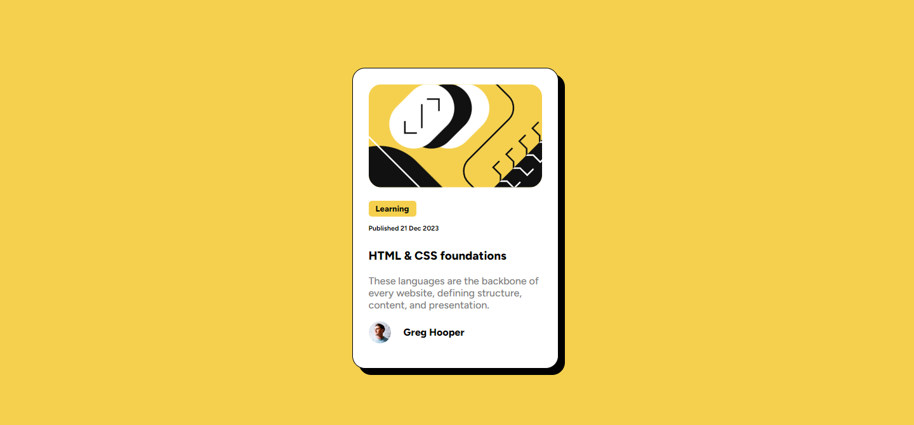
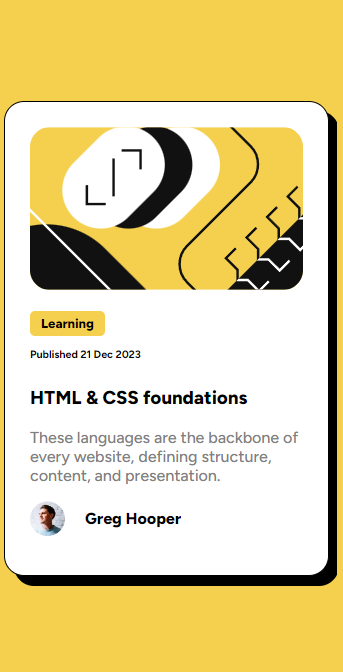

# Frontend Mentor - Blog preview card solution

This is a solution to the [Blog preview card challenge on Frontend Mentor](https://www.frontendmentor.io/challenges/blog-preview-card-ckPaj01IcS). Frontend Mentor challenges help you improve your coding skills by building realistic projects. 

## Table of contents

- [Overview](#overview)
  - [The challenge](#the-challenge)
  - [Screenshot](#screenshot)
  - [Links](#links)
- [My process](#my-process)
  - [Built with](#built-with)
  - [What I learned](#what-i-learned)
  - [Continued development](#continued-development)
- [Author](#author)

**Note: Delete this note and update the table of contents based on what sections you keep.**

## Overview

### The challenge

Users should be able to:

- See hover and focus states for all interactive elements on the page

### Screenshot

### Links

- Solution URL: [Add solution URL here](https://github.com/andzz-zz/blog-preview-card-fem)
- Live Site URL: [Add live site URL here](https://your-live-site-url.com)

## My process

making the layout
putting background colors 
mobile design first

### Built with

- Semantic HTML5 markup
- CSS custom properties
- Flexbox
- CSS Grid
- Mobile-first workflow

### What I learned

Use mobile design first and I found it helpful. Its easier to adjust for responsive from mobile to desktop

To see how you can add code snippets, see below:

### Continued development
Would like to learn Javascript in depth soon then ReactJS

## Author

- Website - [Andrine](https://github.com/andzz-zz)
- Frontend Mentor - [@andzz-zz](https://www.frontendmentor.io/profile/andzz-zz)

